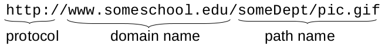
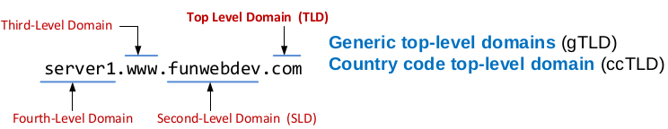
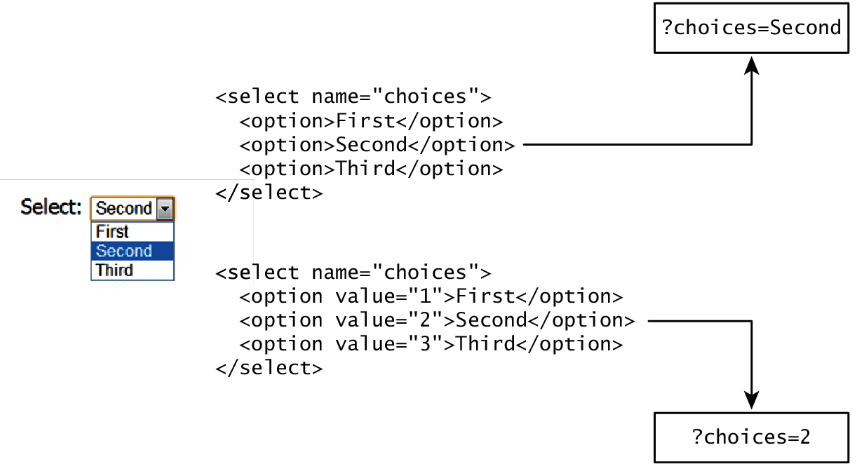
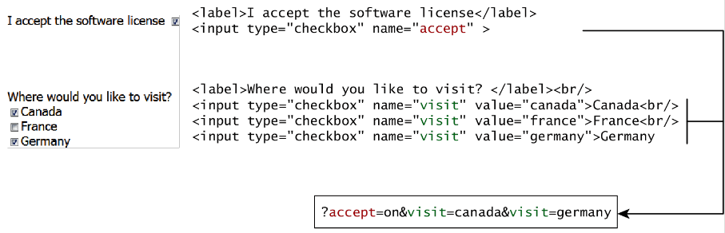
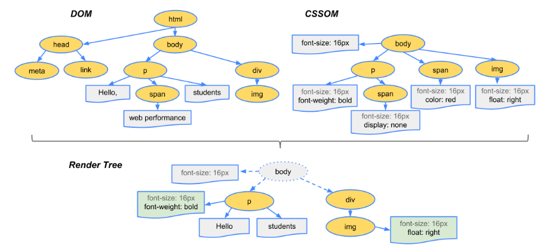
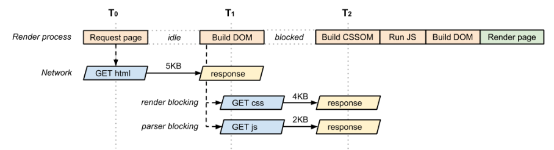
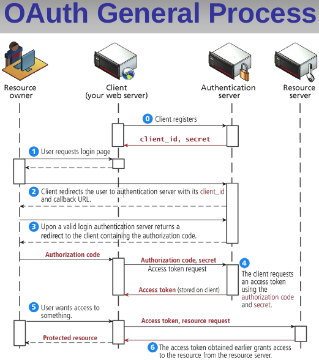
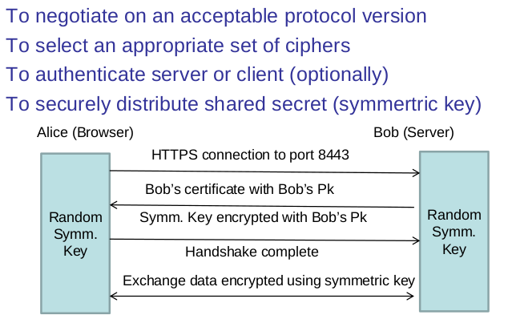

[TOC]
 
# The browser 

---
## 1. URL (Uniform resource locator)
|Protocol|Domain name|Path Name|



### 1.1 The URL domain level



### 1.2 There three methods to find a parameter in express:
 * req.params
 * req.query 
 * req.body

#### 1.2.1 req.params
Given this route:
```javascript
app.get('/users/:userId/books/:bookId',function(req,res){});
```
Given this URL  
``` 
http://localhost:3000/users/34/books/8989
```
**req.params**<br/>
 * req.params.userId
 * req.params.bookId
 
#### 1.2.2 req.query
With **GET**
Given this route:
```javascript
app.get('/usersbooks',function(req,res){});
```
Given this URL  
```
url: http://localhost:3000/usersbooks?userId=34&bookId=8989
```
**req.query**<br/>
 * req.query.userId
 * req.query.bookId
 
#### 1.2.3 req.body
MUST use **POST**
Data {userId:34, bookId:8989} is sent as part of request body

Using **body-parser** middleware
```javascript 1.8
const bodyParser = require('body-parser');

app.use(bodyParser.json()); // for parsing application/json
app.use(bodyParser.urlencoded({ extended: true })); 
```
**req.query**<br/>
 * req.body.userId
 * req.body.bookId
---
## 2. HTTP
 * Using TCP (which is ***Stateful***).
 * HTTP is ***Stateless*** --> server maintains no information about past client requests.
 * Having methods: ***GET, POST*** <br/>***HEAD*** asks server to leave the requested object out of response;
<br/> ***PUT*** uploads file to the sepcified URL;
<br/> ***DELETE*** deletes file specified in the URL field.
 * HTTP/1.0 use ***Non-persistent*** connection (a TCP handshake happens before each HTTP request); 
 HTTP/1.1 in default uses **persistent** connections(Multiple objects can
  be sent over single TCP connection).
<br/><br/> For a page with 11 objects: 1 html + 10 imgs :
<br/> ***HTTP/1.0*** --> 11 RTT for TCP connection --> 22 RTT + 11 tansmit time (html+10objs).
<br/> ***HTTP/1.1*** (_Persistent_ HTTP)--> 1 RTT for TCP connection --> 12 RTT + 11 tansmit time (html+10objs).

### 2.1 GET vs POST
#### 2.1.1 Overview
1. GET change the url and all information in url , POST put information into the **Request body** (hidden from user).
2. GET will create one TCP packet, POST will create two; (GET is more **efficient** and POST **safer**).
3. GET would be **auto**-cashed (stored in cache, history, or bookmarks), POST not.
4. GET size is limited by the **url**, POST not (but also limited by the browser).
5. **Semantically**, GET just fetch data on the server, POST change the data.

#### 2.1.2 With HTML form
(see also at html notes)
```html
<form method="POST" action="/urlDoSomething">
    <fieldset>
        <!--put multiple form element together-->
        <legend>This would be a form title</legend>
        <!--type="text"-->
        <label>Please enter your e-mail adress</label>
        <input type="text" id="address" placeholder="Please enter your e-mail" />
        <p>Please enter your e-mail using the correct format</p>
        <!--type=“radio”-->
        <lable for="gender">gender：</lable>
        <input type="radio" name="gender" value="male" checked />male <br/>
        <input type="radio" name="gender" value="female" />female <br/>
        
        <input type="radio" name="gender" value = 1 checked="checked"/>
        <label>Female</label> <br />    
        <input type="radio" name="gender" value = 0 />
        <label>Male</label> <br />
        <!--select-->
        <lable for="city">city：</lable>
        <select name="city">
            <option value="1" selected>Beijing</option>
            <option value="2">Shenzhen</option>
            <option value="3">Shanghai</option>
            <option value="4">Sydney</option>
            <option value="5">Melbourne</option>
        </select>
        <button class="submit">Submit</button>
        <button class="reset">Reset</button>
    </fieldset>
</form>
```
* Form **action** is for the form-handler: a URL for router or a PHP program.
* Form **method** specify the HTTP method.
* Form element **name** and **value** are to specify the data.



---


* If method is GET, will get url ***.../action?name1=value1&name2=value2***
### 2.2 Connections (further for HTTP/2)
As we mentioned before: HTTP/1.0 is Non-presistent; HTTP/1.1 is Presistent.
HTTP/2 will support the **connection Pepiline**

---
## 3. Caching in HTTP
### 3.1 Expiration Model
* Eliminate the need to **send requests**.
* **Reduce the number of network round-trips** required for many operations.
### 3.2 Validation Model
* Eliminate the need to **get full responses** in many other cases.
* **Reduce network bandwidth** requirements.

---
## 4. Render 
### 4.1 Rendering Process
1. **Request** the HTML --> Process **HTML** elements --> the **DOM** tree (Without meta) --> **Blue line**(DOM ready).
2. ***While*** parser reach the **request of the objects**(like ```<link> <javascript> <a> ```), download it.
    * After receiving **JS**, stop DOM construct, fetches executes it, and the parser can move on (Parser blocking).
    * When the parser sees a **CSS** to load, it issues the request to the server, and moves on. 
    If there are other resources to load, these can all be fetched in parallel 
3. After receiving CSS, process **CSS** file --> the **CSSOM** tree (Only body);
4. Both external CSS and JS should be executed **before DOM been built** (blocking occur).
5. Combine the **DOM** and **CSSOM** --> a **render tree** (Only body);
<br />Only elements that will be displayed appear in the render tree (**Start from <body>**).
6. Run layout on the render tree to compute geometry of each node --> **Red line**(Present Page).



**DOM**
* Each element inside a HTML document is represented as a node.
* **Attributes** and **Text** between a pair of tags are also nodes.

### 4.2 Render/Parser Blocking Resources(Critical Resource)
* Browser needs to **have all of them** before it can start to display something on its window.
* **HTML**, **CSS(traditional)** and **JS(raditional consync)** are render blocking resource.
* **CSS media query** consists of a media type and zero or more expressions that check for the conditions of particular 
media features.

    ```html
    <link href="style.css"    rel="stylesheet">
    <link href="style.css"    rel="stylesheet" media="all">
    <link href="portrait.css" rel="stylesheet" media="orientation:portrait">
    <link href="print.css"    rel="stylesheet" media="print">
    ```
### 4.3 Better Performance
1.  **CSS** place on the **top of HEAD**, **JS** place on the **bottom of HEAD**, 
can make page efficient.
* **Embedded or Inline CSS/JS** may block DOM construction (**Need to be executed immediately**), which also delays the 
render/parser;
<br /> That's why normally don't use inline or embedded CSS/JS.
    * JS(**Parser block**) block parallel downloads: that is, when a JS is downloading, the browser will not start any 
    other downloads.
        1. Move your scripts to the bottom of the page right before your ```</body>``` tag.
        2. Use the ```async``` or ```defer``` directive to avoid render blocking.
    * CSS(**Render block** HTML is also called render block) not block parallel downloads: that is, when a CSS is 
    downloading, the other resource is keep going,
    but only when the CSS resources are construct CSSOM the page can be painted on the screen. 
    * Using **external** JS/CSS faster pages because the files are **cached** by the browser
2. **Minify** the CSS and JS would help improve performance.
3. Use asynchronous script to prevent JS parser blocking.
<br /> Use media detect```<link href="style.css" rel="stylesheet" media="print">``` to prevent CSS render block



---
## 5. Security

### 5.1 Requirement
1. **Authentication**
provides a way of identifying a user, typically by having the user enter a valid user name and 
valid password before access is granted.
2. **Authorization** specify what the user are allowed to do/see.
3. **Confidentiality** No one can look at the information. 
4. **Data Integrity** No one can mess with legal user’s data and communication.

### 5.2 Apply
1. Authentication can be applied by **own sign up form** and **third-party (OpenID)**
2. **OpenID vs OAuth**: OAuth will not shared the client information to the third-party.
<br />
* **passport** module makes it easy to use many popular third party services through various strategies.
* **acl** module provides simple role based authorization implementation.

### 5.3 Encryption
1. **Symetric** and **Asymetric**
* Asymmetric way use public key and private key:
* Public key for others and to encrypt the message.
* Private key for self-keep and to decrypt the message. 
2. **Digital Certificate**
* Use Hash function to get message digest.
* Use private key to encrypt the digest to prevent others to change the content.
3. **Certificate Authority (CA)**
* In case hacker change the public key to pretend to sender.
* CA is pulic known center and his public key can search in the internet (**Cant be pretended by hacker**).
* Use CA's private key and sender's public key to encrypt.
* Receiver can use CA's public key to get the sender's public key.
**As CA's public key can't be pretend, it's well-know for everyone**
    
### 5.4 Transport Layer Security and SSL


## 6. Server Related
### 6.1 HTTP Request Processing
* Persistent connection
* Multiple requests arrive in one connection
* Server needs to ensure that responses are sent back in the order of request arrival

