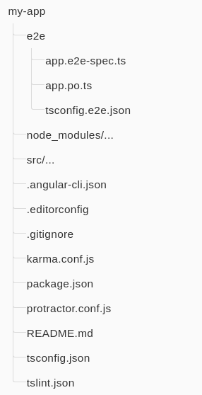
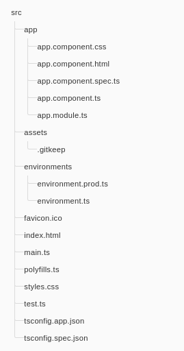
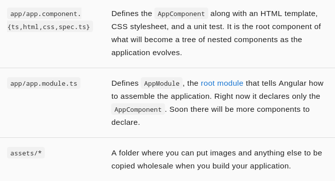
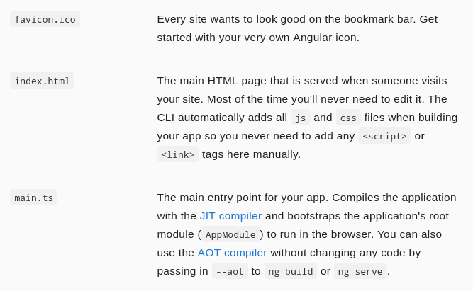
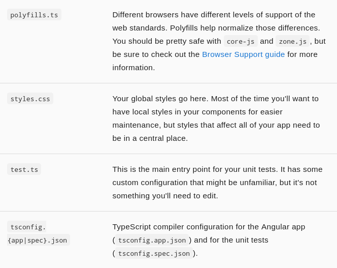

#ng2

##1.Install & Initial
Create a new project based on the QuickStart

Clone the QuickStart project
```
git clone https://github.com/angular/quickstart  my-proj
cd my-proj
```
Remove the old git    
```
rm -rf .git
```

Initial and config your own git
```
git init
git add .
git commit -m "Initial commit"
git remote add origin <repo-address>
git push -u origin master
```
Install the npm dependency packages described in the package.json
```
npm install
npm start
```

##2. The files



------------------------



-----------------------
##3.

For angular:


```bash
npm install -g @angular/cli

ng new myapp
cd ./myapp
ng serve

```

For ionic & cordova:
```bash
npm install -g ionic cordova

ionic start myapp
cd ./myapp
ionic serve

ionic cordova platform add android
ionic cordova emulate android

ionic cordova platform add browser
ionic run browser
```